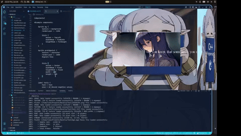

# Novella
## THIS PROJECT IS STILL UNDER ACTIVE DEVELOPMENT

> Novella is a visual novel engine based on self-contained declarative scenes and a simple sandboxed scripting language

<p align="center">
  
</p>

## Features
   - Declarative scene format
   - Built-in scripting language
   - Resource management
   - Component-based development framework
   - Audio playback
   - Layered rendering

## Working on

   - Saving/Loading
   - Adding more components   
   - Editor
## Examples
> Projects define window properties and the source of the scenes, Scenes describe UI layout, resources and attached scripts, Scripts define behaviour through a simple engine API

### Creating a project
>A project file defines the application window and the available scenes
```nproject
Window{

    width = 1920
    height = 1190
    title = "My visual novel"    
    targetFPS = 60
    icon = "Resources/icon.png"

    Flags{

        resizable
        undecorated
        
    }
}

Scenes{

    mainMenu = "Scenes/MainMenu.nsc"
    hallway = "Scenes/Hallway.nsc"

}
```

### Making a scene
>Scene files declare resources, Components, and attached scripts
```nscene
Resources {


    texture background = "Resources/mainMenu.png"
    texture button = "Resources/button.png"
    music bgm = "Resources/bgm.ogg"
}

Components{

    Sprite bg {

        texture = background
        renderLayer = -1200

        Style {
            anchor = TopLeft
            widthMode = FitWidth
            heightMode = FitHeight
        }
    }

    Button play{

        texture = button
        renderLayer = 0

        Style {
            anchor = Center
            widthMode = Fixed
            heightMode = Fixed
            width = 400
            height = 200
            offset = (0,-300)
        }
    }

    Button options{

        texture = button
        renderLayer = 0

        Style {
            anchor = Center
            widthMode = Fixed
            heightMode = Fixed
            width = 400
            height = 200
            offset = (0,0)
        }
    }

    Button close{

        texture = button
        renderLayer = 0

        Style {
            anchor = Center
            widthMode = Fixed
            heightMode = Fixed
            width = 400
            height = 200
            offset = (0,300)
        }
    }
}

Scripts{

    mainMenuLogic = "Scripts/mainMenuLogic.nvs"
}
```

### Calling the components in the main menu
> Scripts contain gameplay logic and interact with engine objects through the Novella API
```nscript
var playButton = Object.get("play");
var optionsButton = Object.get("options");
var closeButton = Object.get("close");

fn handleButtons():

    var mouseButton = Input.getButtonPressed();

    if Input.isObjectClicked(playButton, mouseButton) then

        Scene.load("hallway");  
    endIf

    if Input.isObjectClicked(closeButton, mouseButton) then

        Window.close();
    endIf
endFn
#script entrypoint
fn main():

    handleButtons();

endFn

```
## Documentation

see the '/docs' directory
## Try it out

**Platform Support:** Tested on Arch Linux. Other Linux distributions may also work, but they have not yet been tested. Windows support is planned in the future.

1. **Clone the repository:**
```bash
   git clone https://github.com/CodigaBorealis/Novella.git
   cd Novella
```
2. **Install required libraries:**
```bash
sudo pacman -S raylib
```
3. **Build the project:**
```bash
cd Core
mkdir build && cd build
cmake ..
make
```
4. **Run:**

- Play around with the bundled example files
## Dependencies

Novella wouldn't be possible without:

- [Raylib] - window management, rendering, audio, input, and graphics abstraction

## License

MIT

**Feel free to fork this project or contribute to it!**

[//]: # (These are reference links used in the body of this note and get stripped out when the markdown processor does its job. There is no need to format nicely because it shouldn't be seen. Thanks SO - http://stackoverflow.com/questions/4823468/store-comments-in-markdown-syntax)

   [Raylib]: <https://github.com/raysan5/raylib>
